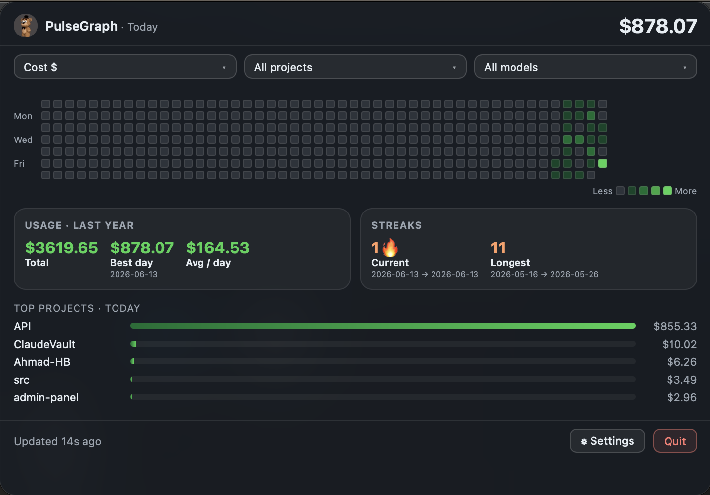
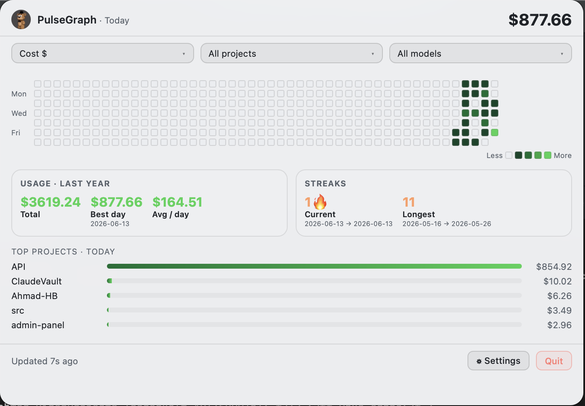
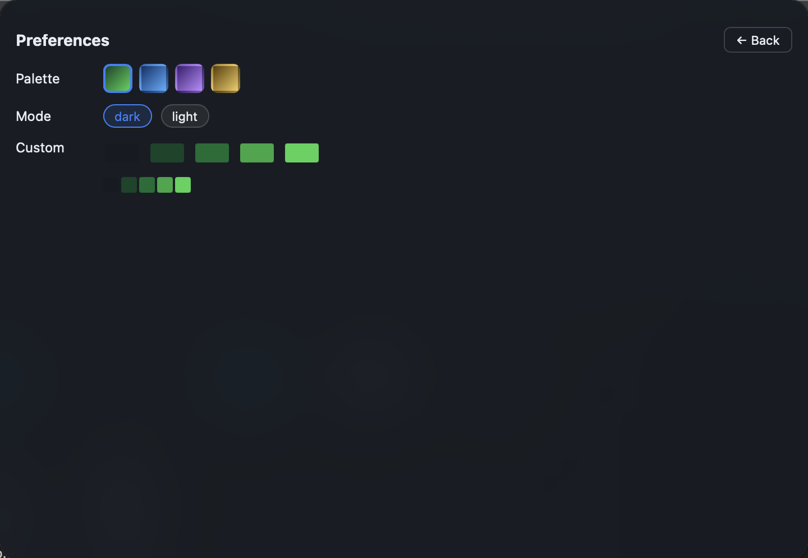
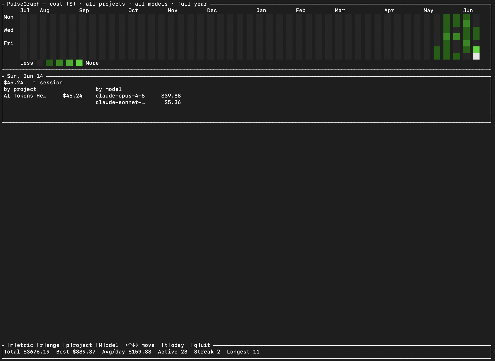

<div align="center">
  
  <h1>PulseGraph</h1>
  <p><strong>Your AI token usage, at a glance.</strong></p>
</div>

PulseGraph turns the transcripts that Claude Code already writes to your disk
into a GitHub-style contribution heatmap — so you can see how much you're using
AI, day by day.

No accounts, no network, no scraping: it reads `~/.claude/projects/**/*.jsonl`
locally and computes everything on your machine.

> **Status:** the `core` engine, an interactive terminal **TUI**, and a native
> **macOS menu-bar app** (the primary experience) are all working.
> Windows/Linux tray support is planned — the core and UI are cross-platform;
> only packaging remains.

## The app

A live cost readout sits in your macOS menu bar; clicking it opens a popover
with:

- A **heatmap** of recent usage intensity.
- Three side-by-side dropdowns: **metric**, **project**, and **model**.
- **Stat cards** — total, best day, average per active day, and current /
  longest **streak**.
- A **per-project** breakdown for today.
- Full **theming** — presets (GitHub green, blue, purple, amber), dark / light
  mode, and a custom palette editor.
- An optional **local profile image** (you pick a file; it never leaves your
  machine).

The app is built on the same `core` as the CLI.

## Screenshots

<div align="center">
  
  <br /><em>The popover — heatmap, metric/project/model dropdowns, stat cards, and per-project breakdown.</em>
  <br /><br />
  
  <br /><em>Light mode.</em>
  <br /><br />
  
  <br /><em>Preferences — palette presets, dark / light mode, and a custom palette editor.</em>
  <br /><br />
  
  <br /><em>The terminal UI — an interactive heatmap with a day-detail breakdown and live stats, driven from the keyboard.</em>
</div>

## What it measures

Switchable metric:

- **cost ($)** — estimated from a bundled per-model price table (cache writes
  and reads priced with the documented multipliers); unknown models show `—`
  rather than a fabricated number.
- **billable tokens** — input + output + cache-writes.
- **output tokens**.
- **raw total** — everything, including cache reads.

## Install / run

### macOS menu-bar app

Requires a recent stable Rust toolchain and Node.js.

```bash
git clone https://github.com/Ahmad-HB/pulsegraph.git
cd pulsegraph/app
npm install
npm run tauri build          # bundles PulseGraph.app
# → app/src-tauri/target/release/bundle/macos/PulseGraph.app
```

For development: `npm run tauri dev`.

### CLI

```bash
git clone https://github.com/Ahmad-HB/pulsegraph.git
cd pulsegraph

cargo run -p pulsegraph-cli          # launches the interactive terminal UI
```

Run in a real terminal and PulseGraph opens an **interactive heatmap** you drive
from the keyboard:

| Key | Action |
|-----|--------|
| `← ↑ ↓ →` | move the day cursor (the detail panel follows) |
| `t` | jump to today |
| `m` | cycle metric — cost → billable → output → raw |
| `r` | cycle range — 12 weeks → 30 days → full year |
| `p` | filter by project |
| `M` | filter by model |
| `q` / `Esc` | quit |

You can preset the starting metric and filters with flags:

```bash
cargo run -p pulsegraph-cli -- --metric billable --project my-repo
cargo run -p pulsegraph-cli -- --model claude-opus-4-8
```

For scripting, output stays non-interactive automatically — piping or
redirecting prints a static heatmap, and `--json` emits machine-readable data:

```bash
cargo run -p pulsegraph-cli -- --json        # JSON for scripts
cargo run -p pulsegraph-cli | less -R        # static heatmap (piped)
```

Flags: `--metric <cost|billable|output|raw>`, `--project <name>`,
`--model <id>`, `--json`.

Colors degrade automatically: 24-bit where the terminal supports it, xterm-256
otherwise (so Apple Terminal renders correctly), and a glyph ramp under
`NO_COLOR`.

> **Add a screenshot:** drop a capture of the TUI at
> `assets/screenshots/cli-tui.png` and it will appear in the
> [Screenshots](#screenshots) section above (that path is already referenced).

## How it works

```
~/.claude/projects/**/*.jsonl
        │  discover + stream-parse (tolerant of malformed lines)
        ▼
   UsageEvent (source-agnostic)
        │  aggregate by local-day / project / model
        ▼
   metrics + streaks + cost   ──►  CLI heatmap  +  macOS menu-bar app
```

An incremental SQLite cache keyed by `(file, mtime)` means only changed
transcript files are re-parsed, so repeated runs are near-instant. The internal
`UsageEvent` is source-agnostic by design: support for other AI agents (Cursor,
Copilot, …) can be added later by writing a new parser, with no changes to
aggregation, metrics, or the UI.

## Project layout

- `crates/core` — `pulsegraph-core`: discovery, parsing, aggregation, pricing,
  streaks, and the incremental cache. Fully unit-tested.
- `crates/cli` — `pulsegraph-cli`: the `pulsegraph` terminal binary.
- `app/` — the Tauri (Rust) + React menu-bar app.
- `assets/` — logo and screenshots.

## License

PulseGraph is **dual-licensed**:

- Open source under **AGPL-3.0** — see [`LICENSE`](./LICENSE).
- A **commercial license** is available for proprietary / closed-source use —
  see [`COMMERCIAL.md`](./COMMERCIAL.md).

© 2026 Ahmad Hbahbeh.
